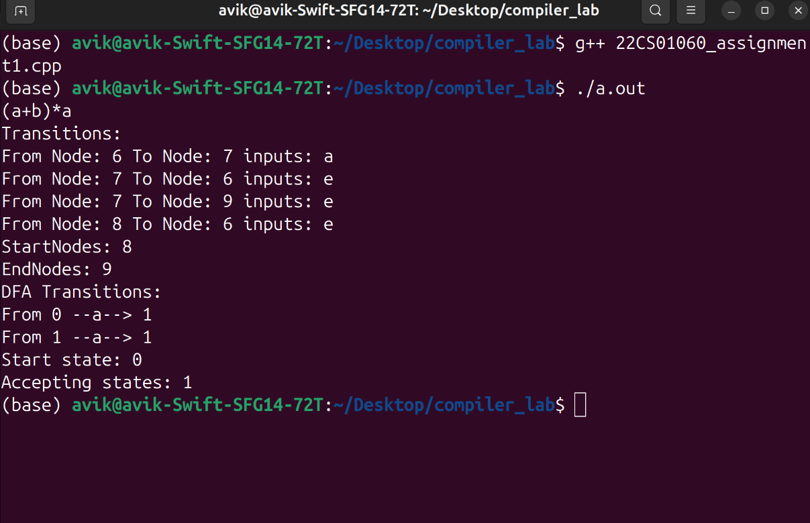
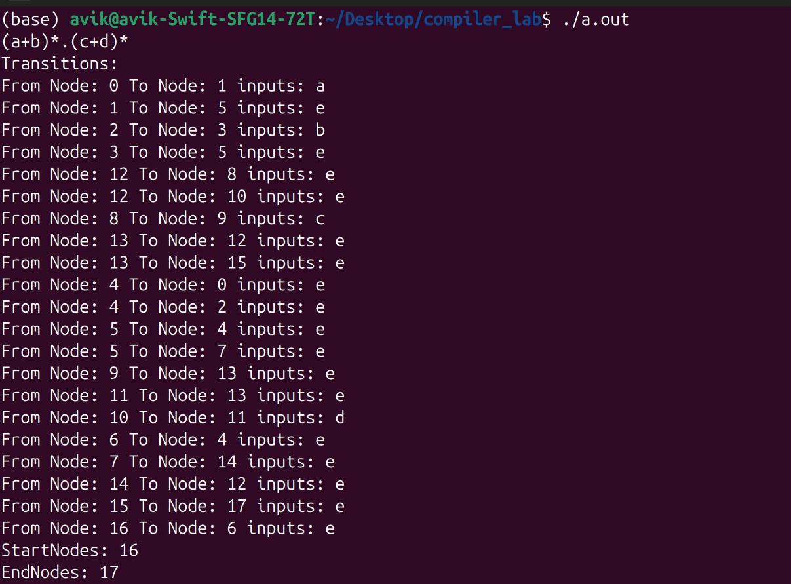
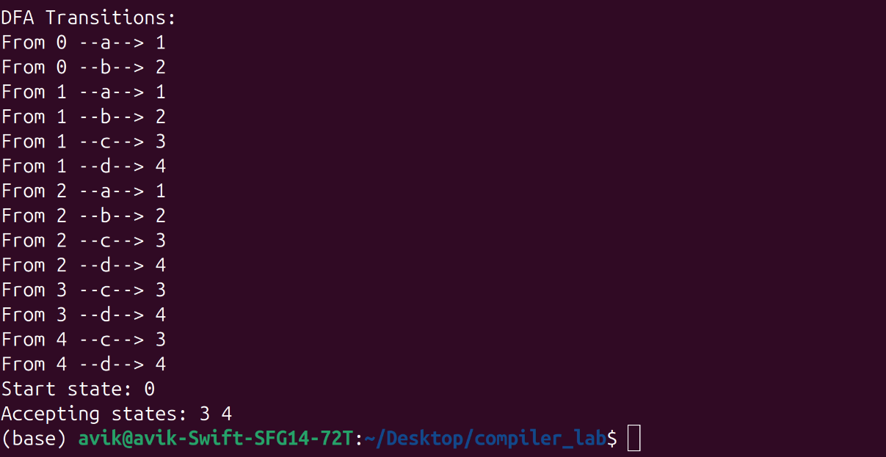

# Regular Expression to NFA and NFA to DFA Converter in C++
## Features
- **Converts regular expressions (with +, ., and \*) to NFA.**
- **Computes epsilon closure for epsilon transitions.**
- **Converts a NFA to DFA.**
> Note: Use explicit concatenation operator (`.`) in the input.

## How to run in terminal
- g++ regex_to_nfa_dfa.cpp
- ./a.out
- give the input regular expression (example: (a+b)*.a)
- press enter
### example1
 

### example2
 
 

## GitHub

- [GitHub Repository](https://github.com/wanderer1500/REGEX_NFA_DFA_CONVERTER)

